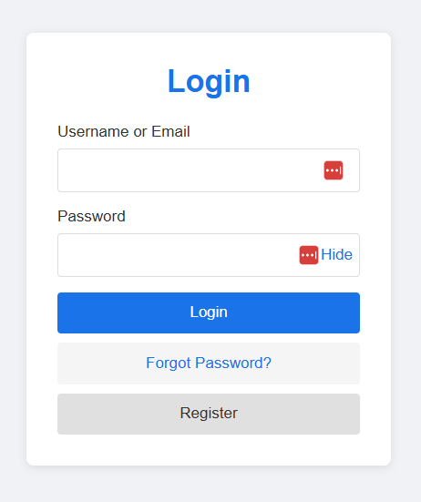
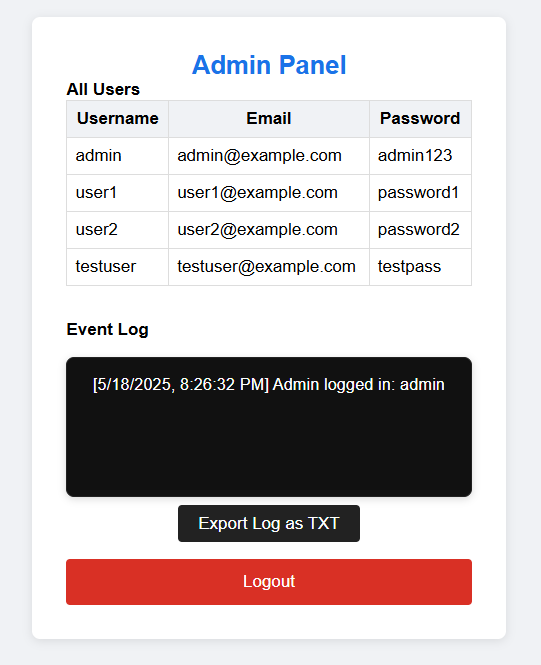

# Login & Registration System with Password Strength Checker and Admin Panel

This project is a **responsive web-based authentication system** built with HTML, CSS, and JavaScript. It supports login, registration, password strength feedback, password reset requests, and a dynamic admin panel with event logging and export capabilities.

---

##  Screenshots

### Login Page


### Admin Panel


---

##  Features of Your Login System

###  Login System
- Users can log in with a **username or email** and **password**.
- Credentials are checked against a `users.json` file (fetched dynamically via JavaScript).
- Admins are redirected to the **admin panel**; regular users are shown a welcome page.

###  Registration System
- New users can register with a **username, email, and password**.
- Username and email must be **unique**.
- Password strength is checked in real-time.
- New users are added to the session memory (not written back to `users.json` due to static hosting).

### Password Strength Checker
- Real-time feedback: **Weak**, **Medium**, **Strong**.
- Displays a checklist of requirements:
  -  At least 8 characters  
  -  One uppercase letter  
  -  One lowercase letter  
  -  One number  
  -  One special character

### Show/Hide Password
- Password fields in both login and registration forms include a **toggle visibility** button.

### Forgot Password
- Users can request a password reset by entering their email.
- A reset message is displayed (demo only).
- Logs the request in the **admin event log**.

### Admin Panel
- Accessible via admin login (`admin@example.com`, `admin123`).
- Displays a **table of all users** (username, email, password).
- Shows a **live event log** of key actions:
  - Logins
  - Failed login attempts
  - Password reset requests
  - Registrations

### Export Log as TXT
- One-click export of the admin event log to a `.txt` file.

### Session-Based Event Logging
- Logs are stored in memory for the session and updated live.

### Responsive, Modern UI
- Clean layout
- Mobile-friendly
- Styled using pure CSS and modern design practices

---

##  File Structure

```plaintext
.
├── Password_checker.html     # Main HTML file with embedded CSS & JS
├── users.json                # Simulated database of users
├── LoginPage.png             # Screenshot of login page
├── AdminPortal.png           # Screenshot of admin panel


## How to Run

### Option 1: Open Directly in Browser

1. Download or clone the repo.
2. Double-click `Password_checker.html` (or right-click > Open With > your browser).

### Option 2: Use Live Server (recommended)

1. Install Live Server globally:
   ```bash
   npm install -g live-server
